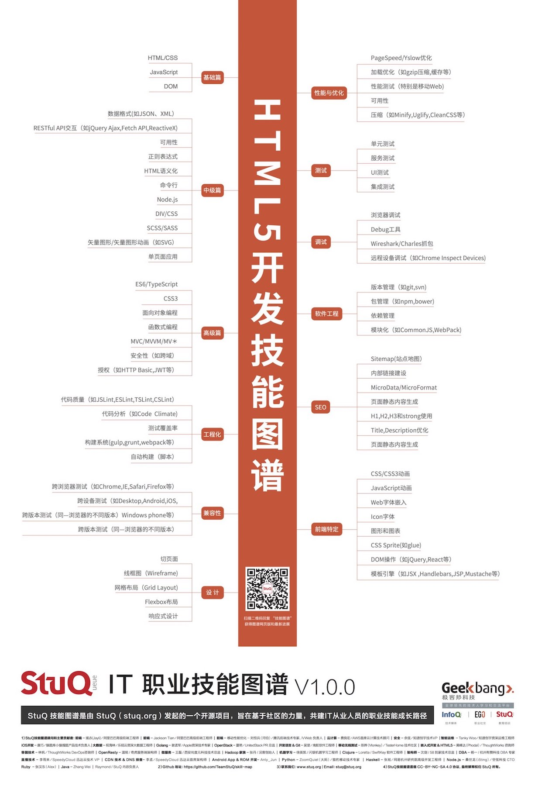

# 课程1

[](http://skill-map.stuq.org/)
><a href="#html">1.HTML基本标签</a>
><a href="#css">2.基本css属性</a>
><a href="#js">3.简单的javascript</a>
><hr>

## *<a name="html">HTML基本标签</a>*

>####什么是HTML 标签
>* HTML 文档和 HTML 元素是通过 HTML 标签进行标记的
>* HTML 标签由开始标签和结束标签组成
>* 开始标签是被括号包围的元素名
>* 结束标签是被括号包围的斜杠和元素名
>* 某些 HTML 元素没有结束标签，比如 <br />

>####HTML 标题
>HTML 标题（Heading）是通过 ``` <h1> - <h6>```  等标签进行定义的。

>####HTML 段落
>HTML 段落是通过 <p> 标签进行定义的。

>#### HTML 块
>
>```<div></div>```
>
>```<section></section>```

>#### HTML 列表
>
>```<ul>```
>
>   ```<li></li>```
>
>   ```<li></li>```
>
>```</ul>```
>
>```<ol>```
>
>   ```<li></li>```
>
>   ```<li></li>```
>
>```</ol>```

>### HTML图像
>
>```	 ```

>### HTML 链接
>
>```<a href=""></a>```

> #### HTML 按钮
>
> ```<button></button>```


### [*HTML属性*](http://www.w3school.com.cn/tags/html_ref_standardattributes.asp)

> ### id
>
> ```<div id="div1"></div>```
>
> ### class
>
> ```<div class="divclass"></div>```

### [*HTML表单*](http://www.w3school.com.cn/html/html_forms.asp)

> ```<form></form>```
>
> ```<input />```
>
> ['text','checkbox','radio','file']
>
> ['range','date','color']\(html5)
>
> ```<textarea></textarea>```
>
> 

etc.

## *<a name="css">CSS基础</a>*

### [*选择器*](http://www.w3school.com.cn/cssref/css_selectors.asp)

> #### id选择器
>
> [#*id*](http://www.w3school.com.cn/cssref/selector_id.asp)
>
> ### 类选择器
>
> [.*class*](http://www.w3school.com.cn/cssref/selector_class.asp)
>
> #### 属性选择器
>
> [[*attribute*\]](http://www.w3school.com.cn/cssref/selector_attribute.asp)
>
> #### 标签选择器
>
> [*element*](http://www.w3school.com.cn/cssref/selector_element.asp)

### [*基本属性*](http://www.w3school.com.cn/cssref/index.asp)

> #### 大小
>
> ```width,height```
>
> #### 背景
>
> ```background,background-color```
>
> #### 字体
>
> ```font-size,font-family,color```
>
> #### 边框
>
> ```border```
>
> #### 边距
>
> ```margin,padding```
>
> #### 定位
>
> ```position```

## *<a name="js">JS基础</a>*

### 变量

> #### 定义变量
>
> ```var```
>
> ```let,const```(html5)
>
> #### [*类型*](http://www.w3school.com.cn/js/js_datatypes.asp)
>
> 数字 ```var number = 6;  ```
>
> 字符串 ```var str = "litong"; ```
>
> bool类型 ```var right=true;var wrong=false```
>
> 数组 ```var cats=new Array();cats[0]='小白';cats[1]='小黑'``` 
>
> 对象 ```var dogs = {name:'小黄',sex:"雌性"}```
>
> Undefined 和 Null ```var none = null```
>
> function ```var fn = function(){}```
>
> 
>
> #### [*JS函数*](http://www.w3school.com.cn/js/js_functions.asp)
>
> ```function add(x,y){return x+y;} console.log(add(5,6))```;
>
> ```var add = function(x,y){return x+y;};console.log(5,6);```
>
> ```(function(x,y){console.log(x+y);})(5,6)```

### JS流程控制

> [*if…else*](http://www.w3school.com.cn/js/js_if_else.asp)
>
> 略

> [*for*](http://www.w3school.com.cn/js/js_loop_for.asp)
>
> 略

> [*switch*](http://www.w3school.com.cn/js/js_switch.asp)
>
> 略

> [*while*](http://www.w3school.com.cn/js/js_loop_while.asp)
>
> 略

### JS全局对象

> ### window
>
> location
>
> screen
>
> History
>
> Cookies

### JS事件

> onclick
>
> onchange
>
> onblur

### 异步

> ajax

### 题外

* 1.再复杂的页面也是通过这些基础的内容一点一点积淀起来的
* 2.保持良好的编码习惯，有益于自己的提高
* 3.熟练的使用开发工具，能够有效的提高开发效率

### 推荐

[*w3school*](http://www.w3school.com.cn/)

[*freecodecamp社区*](http://www.freecodecamp.cn/)

[*github*](https://github.com/)

[*stackoverflow*](https://stackoverflow.com/)

[*慕课网*](http://www.imooc.com/)

